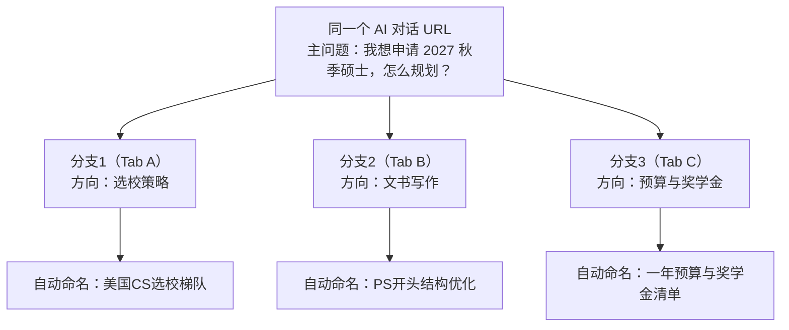

# AI Chat Branch

`AI Chat Branch` 是一个 Chrome 插件，用来把 AI 对话按“分叉”管理：  
同一个会话 URL，复制成多个标签页后，每个标签页都可以沿不同方向继续追问，不再把所有问题混在一个对话里。

## 为什么需要它

现实里和 AI 聊天时，经常出现这种场景：

- 你先问了一个主问题
- 接着突然想到多个追问方向
- 但都塞在同一个对话框里，历史会互相干扰，后续回看也很痛苦

`AI Chat Branch` 的思路是：

- 保留同一个入口对话（同 URL）
- 用复制标签页形成分支
- 每个分支独立推进、独立命名、独立保存快照

## 一图说明（真实场景）

示例：你在做“出国读研规划”，中途出现 3 个方向：选校、文书、预算。

你最终得到的是“同源、多分支、可回溯”的对话结构，而不是一条冗长混乱的聊天记录。

## 核心功能

- 对话分叉
  - 跟踪当前标签页作为根节点
  - 复制标签页自动创建子分支
  - 手动粘贴同会话 URL 新开标签页时，会自动作为根分支入树
- 快照保存
  - 每个节点保存 `html/text/styles`
  - 即使标签页关闭，仍可回看上下文
- 自动命名
  - Track 后会立即触发命名（节点会短暂显示“命名中...”）
  - 根据“最新对话内容”持续更新分支标题
  - 快速识别每个分支当前讨论主题
- 树形管理
  - 右键节点可切换/复制/查看快照/自动命名/删除
  - 支持拖拽节点重排父子关系（整棵子树一起移动）
- 中英文界面
  - 支持 `English` / `中文`
  - 默认规则：浏览器语言以 `zh` 开头则中文，否则英文

## 安装与快速使用

1. 打开 `chrome://extensions`
2. 开启 `开发者模式`
3. 点击 `加载已解压的扩展程序`
4. 选择项目目录 `AIChatBranch`
5. 打开侧边栏，点击 `Track Tab` 开始跟踪
6. 复制该标签页形成分支，在不同标签页分别继续追问
7. 如需调整结构，可直接拖拽节点到目标父节点或拖回根级

## 设置项说明

侧边栏 -> `Settings`：

- `Auto Naming Method`（自动命名方式）
  - `Built-in AI`：内置 AI 命名
  - `Custom API`：自定义 OpenAI 兼容接口（`Base URL`、`API Key`、`Model`）
  - `Local Algorithm`：本地算法（不调用远程 API）
- `Appearance`（界面外观）
  - `System` / `Light` / `Dark`
- `Language`（语言）
  - `English` / `中文`

## 说明

- 使用 `Built-in AI` 或 `Custom API` 命名时，会将用于命名的文本发送到对应 API。
